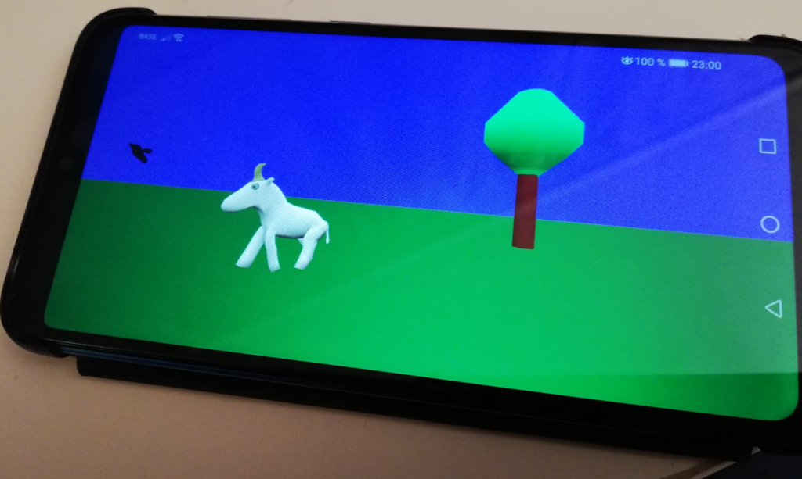
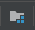

Avoid the Bug 3D - Android Edition
==================================

Android edition of [Avoid the Bug](https://github.com/dimi309/avoidthebug) game

Build small3d for android. Then copy:

  small3d/build/include to android/app/deps/include
  small3d/build/lib to android/app/deps/lib
  small3d/build/shaders to android/app/src/main/assets/resources/shaders

If you receive an error that looks like this when opening the project in Android Studio:

No version of NDK matched the requested version (A). Versions available locally: (B)

... you need to set your NDK version to the one you have installed (B). So you need to open the
project structure dialog by clicking on the project structure icon 
or by pressing Ctr+Alt+Shift+S and then setting the "NDK version" under "Modules" to (B).
